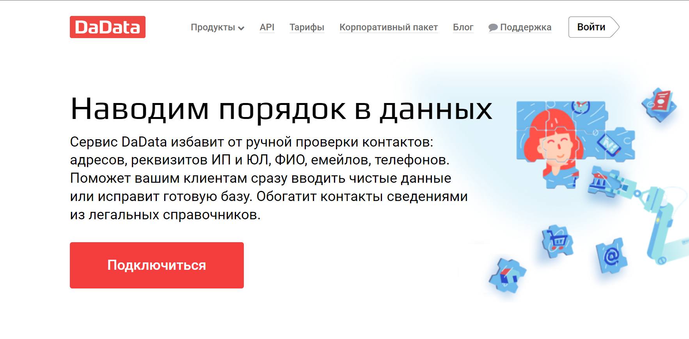
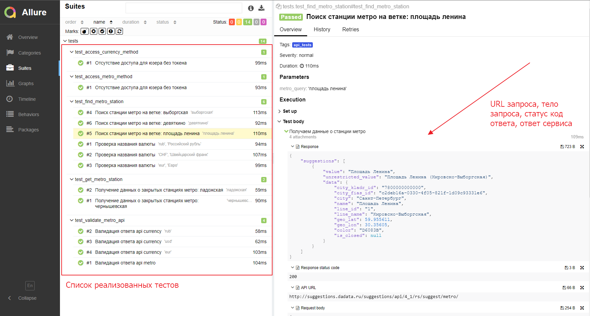
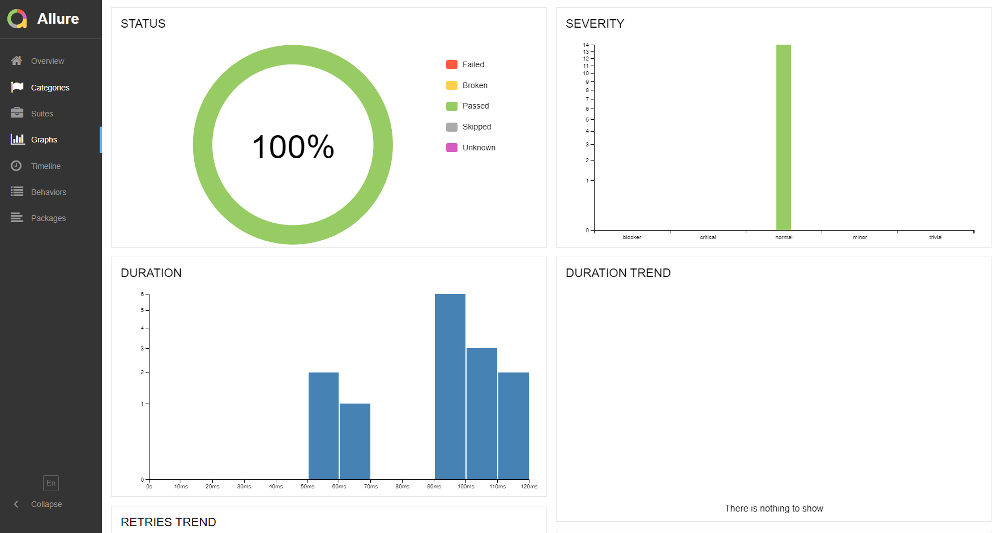
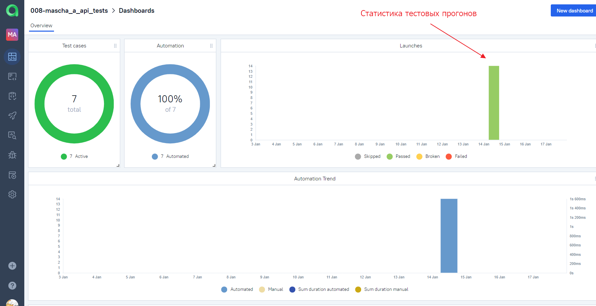
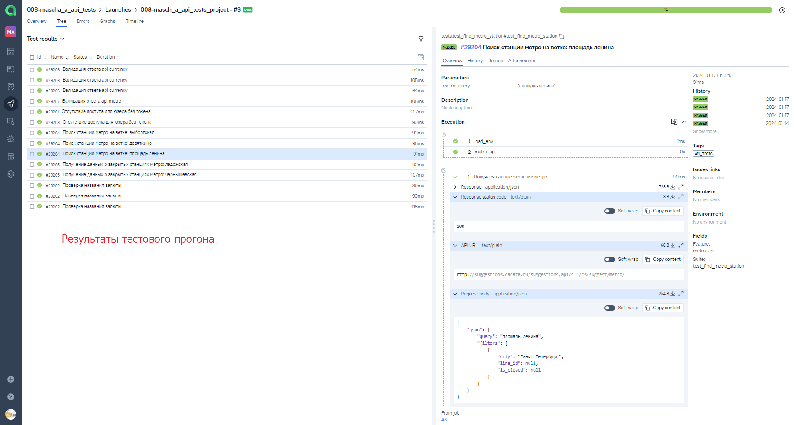
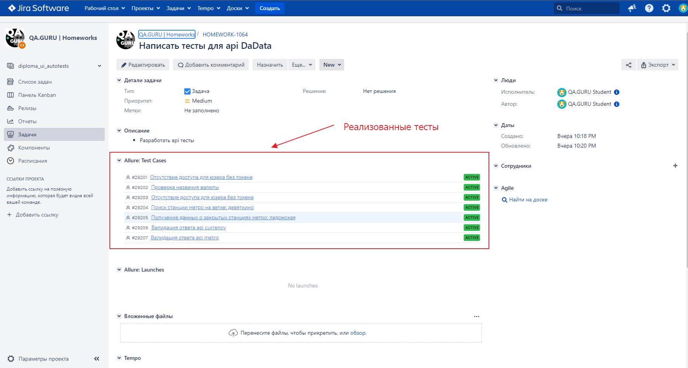
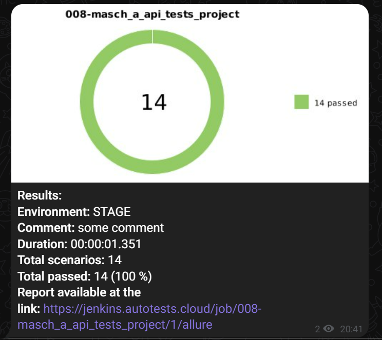

# Автоматизация тестирования API DaData
> <a target="_blank" href="https://dadata.ru/">dadata.ru</a>
>

## Особенности проекта
* Интеграция с Allure TestOps
* Отчеты Allure Report
* Сборка проекта в Jenkins
* Отчеты с request body, response body, status code
* Оповещения о тестовых прогонах в Telegram

> 
## Список, реализованных проверок
* Валидация ответов, статус коды
* Отсутствие доступов для юзеров без токена
* Принадлежность станции метро конкретной ветке
* Получение данных о закрытых станциях метро
* Проверка названий валют

## Запуск тестов из Jenkins
### Ссылка на проект в Jenkins
> <a target="_blank" href="https://jenkins.autotests.cloud/job/008-masch_a_api_tests_project/">Jenkins</a>
> 
1. Перейти в Jenkins
2. Нажать Build with Parameters
3. Выбрать параметры запуска - Окружение: Prod/Stage
4. Нажать Build

## Allure Report

### Графики

## Интеграция с Allure TestOps
### Дашборд с информацией о тестовом проекте

### Результаты запуска тестов

## Интеграция с Jira
<a target="_blank" href="https://jira.autotests.cloud/browse/HOMEWORK-1064">Ссылка на проект в Jira</a>

## Отчет о запуске тестов в Telegram
### Диаграмма с информацией о запущенных тестах в Telegram

